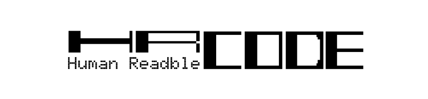
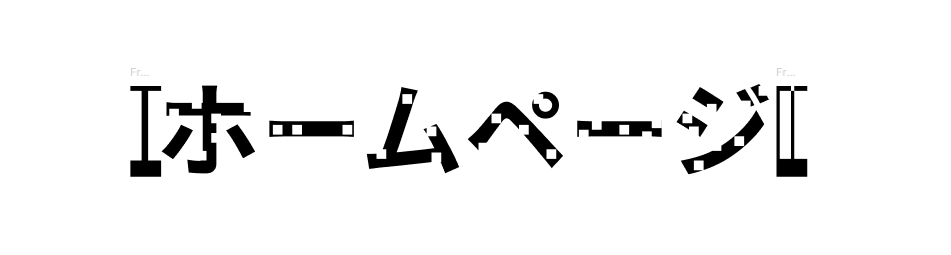
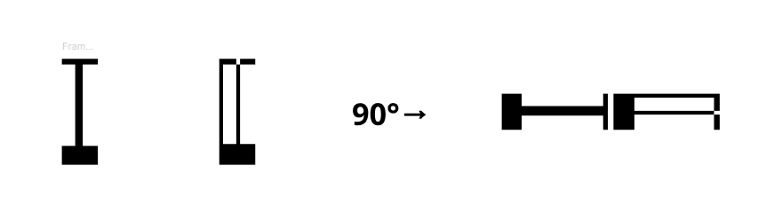

# HR Code

<p align="center">
  
</p>

<p align="center">
  <b>Human Readable Code</b><br>
  人間にも読める、機械可読コード。
</p>

---

## HR Codeとは

**HR Code（Human Readable Code）** は、

> **人間には「何の情報なのか」が読め、機械には「その詳細情報」が読める**

ことを目指した実験的な機械可読コードです。

現在広く使われているQRコードは、スマートフォンなどから高速かつ正確に情報を読み取れる一方で、人間がコードそのものを見ても、そこに何が記録されているのかを判断することは困難です。

例えば、QRコードを見ただけでは、

- Webサイト
- Wi-Fi情報
- 連絡先
- 地図
- アプリへのリンク
- その他のデータ

のどれが記録されているのか分かりません。

HR Codeでは、**人間が読む文字そのものに機械向けの情報を組み込む**ことで、この問題を解決できないか検証します。

---

## コンセプト

例えば、次のようなHR Codeがあったとします。

<p align="center">
  
</p>

人間が見ると、

> **ホームページ**

と読むことができます。

そのため、読み取る前から

> 「これはWebサイトを開くためのコードだ」

と理解できます。

一方、スマートフォンなどの機械は、文字に組み込まれたマーカーを解析することで、

```text
https://example.com
```

のような詳細情報を取得します。

つまり、

```text
人間 → 情報の意味を読む
機械 → 情報の詳細を読む
```

という役割分担を目指します。

### Humans read the meaning. Machines read the details.

---

## QR Codeとの違い

QR Codeは、機械から見れば非常に優れたコードです。

しかし、人間から見ると白黒のパターンであり、読み取るまで内容を知ることができません。

```text
QR Code

人間
  ↓
「何が入っているか分からない」

機械
  ↓
「https://example.com」
```

HR Codeでは、

```text
HR Code

人間
  ↓
「ホームページ」

機械
  ↓
「https://example.com」
```

という状態を目指します。

HR CodeはQR Codeを置き換えることを目的としたものではありません。

**「人間が読み取る前に情報の意味を理解できること」**

が重要になる場面で利用できる、新しい機械可読コードの可能性を研究します。

---

## 基本構造

現在、HR Codeは大きく3つの要素から構成することを検討しています。

### Human Readable Layer

人間が読むための情報です。

例えば、

```text
ホームページ
Wi-Fi
連絡先
メニュー
地図
```

など、コードに含まれる情報の種類や目的を文字として表現します。

---

### Machine Readable Layer

文字の内部などに配置された小さなマーカーを機械が読み取ります。

マーカーの、

```text
ある / ない
```

などの状態をデータとして扱い、詳細情報を符号化することを検討しています。

マーカーの形状・配置方法・符号化方式については現在検討中です。

---

### Finder Pattern

HR Codeが画像内のどこに存在するのかを機械が認識するためのパターンです。

現在は、**HR Codeの「H」と「R」をモチーフにしたFinder Pattern**を検討しています。

<p align="center">
  
</p>

Finder Patternには、

- HR Codeの検出
- コード領域の特定
- 上下方向の判定
- 左右方向の判定
- コードサイズの推定
- 撮影角度による歪みの推定・補正

などの役割を持たせることを検討しています。

また、人間に対しても、

> **「この文字はスマートフォンなどで読み取ることができる」**

と示すシンボルとして機能することを目指します。

---

## フォントについて

HR Codeでは、専用フォントを必須としない方式を検討しています。

既存のBold系フォントなど、マーカーを配置するために十分な線幅を持つフォントに対して、HR Code Encoderが機械可読マーカーを追加する方式を想定しています。

将来的には、

- 日本語フォント
- 英語フォント
- フォントの種類
- フォントウェイト
- 文字サイズ

などを変更した場合の認識性能についても評価する予定です。

---

## 現在検討している処理

```text
文字列・Payload
        │
        ▼
┌─────────────────┐
│ HR Code Encoder │
└─────────────────┘
        │
        ▼
    HR Code生成
        │
        ▼
     印刷 / 表示
        │
        ▼
      カメラ
        │
        ▼
 Finder Pattern検出
        │
        ▼
    コード領域抽出
        │
        ▼
      歪み補正
        │
        ▼
   マーカー位置解析
        │
        ▼
      bit列復元
        │
        ▼
   Payload Decode
```

---

## MVP

最初のProof of Conceptでは、HR Codeの基本原理が成立するかを確認します。

目標：

- H / R Finder Patternをカメラから検出する
- FinderからHR Code領域を特定する
- 撮影角度による歪みを補正する
- 文字内のマーカーを検出する
- マーカーをbit列へ変換する
- 埋め込まれたデータを復号する

最初の段階では、QR Codeと同等の情報容量や誤り訂正性能を目標とはしません。

まず、

> **「人間が読める文字の中に、機械が安定して読み取れる別の情報を共存させることが可能か」**

を検証します。

---

## 今後の研究

Proof of Concept完成後、以下について検証する予定です。

- 認識可能距離
- 撮影角度
- マーカーサイズ
- マーカー密度
- フォントによる認識率の違い
- 文字サイズによる認識率の違い
- 日本語・英語での利用
- 誤り検出・誤り訂正
- 情報容量
- 人間から見た文字の可読性
- カメラから見た機械可読性
- Finder Patternの最適化

---

## Status

> [!WARNING]
> HR Codeは現在、アイデアおよび初期設計段階の実験的プロジェクトです。

仕様・Finder Pattern・符号化方式・マーカー形状などは、今後の実験結果によって変更される可能性があります。

---

## 名前について

**HR Code**

**Human Readable Code**

「Human Readable」という名前の通り、人間にとって意味の分かる機械可読コードを目指します。

---

## License

考え中！
